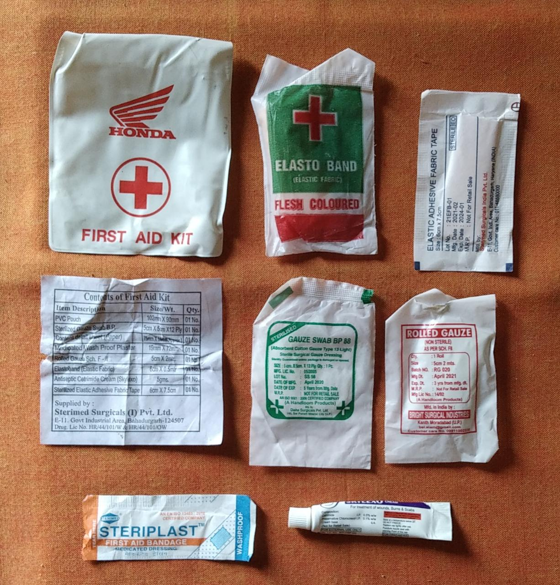
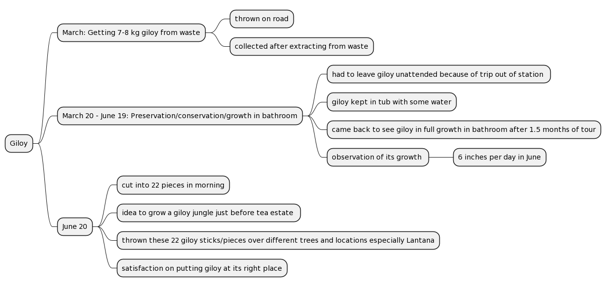

# 2022

### So far, morning of 2022-02-19! 

Straws used by us. Packed again for reuse. For example, for putting oil drops in nostrils. 

Chakotra peels bio enzyme as cleaning agent. Bottles from trash. 

**The Waste Corner**

### After waste collection on 2022-02-19

### Evening 2022-02-20

Tejpatta used in lunch preparation on 2022-02-21.

### 2022-03-04

- Discarded pot gets a new life! 
- We got a happy friend who's rescued lettuce got a happy home.  (:

ECONOMY: Trash -> Gift

### 2022-03-11

Today's morning walk collection on road. 13 _Kulhads_ (for reuse), 18 amlas, 5 raw papayas, giloy, aloe vera to be replanted, two pots that'll be reused.

### 2022-03-12

Some Giloy gifted. 

### 2022-03-13

[Amla pickle](https://nehalsin.github.io/oil-less-pickles/) made of 18 amlas collected from under amla tree on 2022-03-11. 

Decorative art and usage of flowers in waste in park. 

### 2022-03-14

- Aloe Vera leaves used for applying on skin and preparing pickle. 
- Rescued plant replanted.
- Pot from waste collection of 2022-03-11. 

- Waste papaya peels (after pickling) and spoiled aloe vera (that was being used for pickle) used for bio enzyme for plants. 
- Just a drop of it put in plants once prepared.
- Preparation method same as citrus peels' bio enzyme. 

Bottles for ([oil base](https://nehalsin.github.io/oil-base-pickles/)) pickles used from trash. 

### 2022-03-15

- _Kulhad_ from road cleaned several times, dried properly and now one of them being used as a pen stand which was much needed by us. 
- Idea struck just today morning when we were organizing the work desk. 

### 2022-03-16

1. Photographed on 2022-03-17. 
2. All the following have been gifted by a friend.

- Some _kacchi haldi_ (raw turmeric) will be sowed and some will be used for pickle. 

- **As on 2022-08-18** - All gifted to friends over past months on different occasions. 

- Leaves of Lehsun (Garlic), Elaichi (Cardamom), Tejpatta (Indian Bay Leaf) will be eaten raw or some dried to be used in pickling.

- _Kachalu_ will be used for further gifting to a friend. 

### 2022-03-19

- [x] _Kachalu_ gifted to a friend today morning while on walk. 
- Plastic bottle caps (of Pepsi etc) picked up from road to use for closing alcohol bottles (bottles also collected from road, or bought from kabaadis, for use in fermented foods' preparation and storage). 
- Successfully used on many bottles as stable lid already.
- Two caps collected today on morning walk of 2022-03-19. 

- Glass Bottle holder thermocol rack from trash. Picked up from road, cleaned. Cleaned on 2022-03-19. 
- As on 2022-08-18, being used for keeping spices' packets, cow urine bottle, other kitchen accessories. 

### 2022-03-20

- Peels' separation while preparing pickles on 2022-03-20. 

- Aloe vera left overs, Haldi peels left overs, hill lentils, guava peels (from fruit enzyme preparation)

- Big bottle obtained from trash. Usage after cleaning it. 

----

- Bottles cleaned, dried and now in thermocol stand for use. 

----

- Raw turmeric gifted on 2022-03-16 used in making pickle on [2022-03-20](https://nehalsin.github.io/oil-base-pickles/) while keeping aside some for sowing. 

### 2022-03-31

- Noticed use of waste _kulhad_ for _dhupbatti_. 

### 2022-06-20

- Giloy collection, preservation and  reforestation. 

### 2022-08-12

- Started use of bioenzyme made of chakotra peels.

### 2022-08-13 to 2022-08-15

- Collection from jungle - 
    - Gooseberries/amlas
    - Curry leaves
    - Jackfruit seeds - 2
    - Neem leaves
    - Filling water bottles from natural spring
- Collection of unique stones. 
    - Using one for breaking coconut. 
    - Rest being used for acupressure in bathroom. 
    - They can also be used for other purposes as required. 
- Seed packets (fruits, vegetables)
    - Given to three friends on 2022-08-15. 

###  2022-08-16

- Collection of Ganga water.

### 2022-08-17

- Made sweet amla/gooseberries pickle/dry curry and stored in glass jar. 
    - Small raw amla/gooseberries picked up from jungle. 
- Seeds (vegetables, fruits) given to a friend. 

### 2022-08-20

- Started cooking, eating Moringa leaves. 
- Leaves kept for drying/storing after washing. 
- Seed packets 
    - Given to two friends. 

### 2022-11-04

**Important update on food!** 

- Amlas, Sprouts in food. This is third time properly Amlas being brought and made in house. Now this will be continuous process it seems. Earlier two iterations were more about pickling and making jam (jam was successful second time with grated ginger) which were mostly shared with friends and family. In second iteration some was saved for us. Third time all 81 Amlas were made twice, using a simple technique of making special _tadka_ ([recipe here](https://nehalsin.github.io/cooking/2022.html)). 
- Lot of Pahadi Karelas (also called Ram Karela, see Insights section [here](https://nehalsin.github.io/cooking/2022.html)) with Ridge Gourds (total about 7 kg) costed 60/-. Being made daily since 2022-11-02. Made in different ways. Ripened seeds of Karelas collected for gifting. 
    - Selection of ripening vegetables then those cooked first. 
    - Selection done every day. 
    - Waste also generated. Waste food for composting. 
    - No waste in ridge gourd. These were amongst those which none was purchasing. However all ridge gourds turned out to be perfect. 
- Squash (one more new vegetable) bought yesterday. Gifted for sowing as is.
- Amlas being eaten every day. Cooked twice after total 81 brought from friend's place. About 10 thrown as they got spoiled. Rest all cooked today. Amlas turning out to be great recipe these days! _Standardization in cooking happens. And you learn how to cook something best in your own way!_ 
   
   
   
**Current Update 2022-11-04 about drying** 
   
   - Leaves drying 
       - Sehjan
       - Karipatta
       - Harsingar
       - Giloy 
       - Nimbu Ghans
       - Tejpatta
       - Arbi
       

**Reuse of earthen vessels**
   
 - Diwali diyas/lamps washed, dried. Draining them in rivers is not a good idea at all! They will be reused next year in the festival or for some other purpose. 

- Two small sweets' earthen vessels brought from a friend's place. They have been washed, dried and are being reused as seeds' drying vessels. Seeds will be gifted to farmer friends. 

### December 2022 

**The best things in life are not things!** 
1. [A quick recap of Dec 17, 2022 trek of 18 km in INR 105/-](https://nehalsin.github.io/dehradun-day-trek/). 
2. [Glimpse to the food we eat](https://nehalsin.github.io/cooking/2022.html). Raw, sprouted, soaked nuts, fermented flatbreads and what not! 