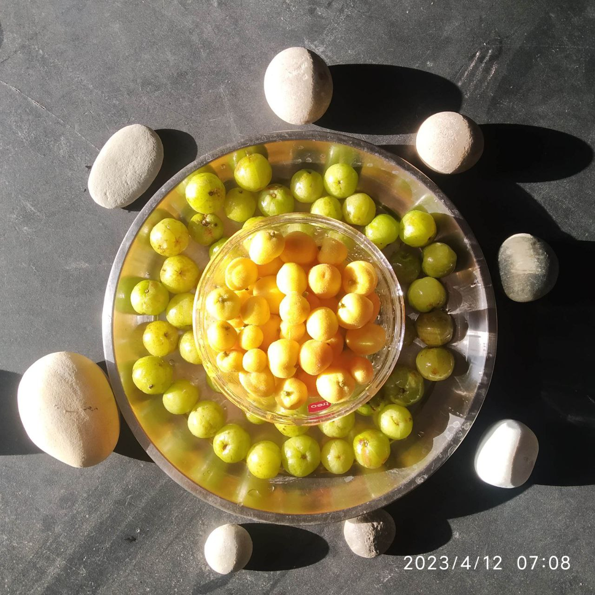

# 2023

Latest on top

## May 

### 2023-05-24

- **Cherry tomatoes, cucumber salad**. Cherry tomatoes picked from a park where this plant was lying uprooted due to previous night's storm. 
- Basil leaves, carom seed leaves plucked from a friend's home.

### 2023-05-23

- Seeds of musk melon rescued from a friend's garbage. 

### 2023-05-12

- Use of empty medicine box for growing a plant seen at a friend's place. 

### 2023-05-02

#### Eating raw Aloe Vera

**References** 

 1.  [https://www.allrecipes.com/article/can-you-eat-aloe-vera/](https://www.allrecipes.com/article/can-you-eat-aloe-vera/)
 2. [https://www.wikihow.com/Eat-Aloe-Vera](https://www.wikihow.com/Eat-Aloe-Vera)
 3.  Honey, Aloe vera mixture: [https://www.linkedin.com/pulse/health-benefits-honey-mixed-aloe-vera-ngoc-anh-bui](https://www.linkedin.com/pulse/health-benefits-honey-mixed-aloe-vera-ngoc-anh-bui)
 4. Honey Aloe vera drink: [https://youtu.be/9UxM4hr-fPo](https://youtu.be/9UxM4hr-fPo)
 5.  [https://www.livestrong.com/article/258966-benefits-of-drinking-honey-aloe-vera/](https://www.livestrong.com/article/258966-benefits-of-drinking-honey-aloe-vera/)
 6. [https://deepgreenpermaculture.com/2019/04/16/identifying-and-growing-edible-aloe-vera/?amp=1](https://deepgreenpermaculture.com/2019/04/16/identifying-and-growing-edible-aloe-vera/?amp=1)
 
 `collected during morning walk`
 
 
 
 
 `raw aloe vera with food`
 
 
 `tomato, cucumber, aloe vera salad`
 
 
 `sprouts, cucumber, onion, aloe vera, butter salad`
 

## April

### 2023-04-24

- Use of water melon rind as salad and also in curry.

### 2023-04-24

- Raw bananas' bunch thrown on road side.
- We discovered on our morning walk. Brought home. 
- Used for curries, pulao, etc.

### 2023-04-12

- Collection of [_dheu_](https://himalayanwildfoodplants.com/2020/09/artocarpus-lacucha-buch-ham-dheu-%E0%A4%A2%E0%A5%87%E0%A4%8A/), gooseberries from under the trees on morning walk. 
- Invention of a new recipe using _dheu_, gooseberries, potatoes and curry leaves on April 11, 2023. Also prepared similar [recipe](https://nehalsin.github.io/cooking/2023.html) further with raw banana, one onion and few garlic cloves today in morning. 

## March

### 2023-03-10 

- Two lemon grass saplings rescued from road. Planted in two separate pots at our home. 

### 2023-03-03

As on 2023-03-03 -

- Using about four bundles of coriander leaves picked up from vegetable mandi (zero cost) on 2023-03-01. A lady standing nearby with a big bag reported picking most of these bundles but later throwing away what even she couldn't pack. We picked up, and are using that in curries!  A sensible gain from the roads! :) Food must be always respected. 
- **2023-02-19**: Ash gourd seeds' dried and collected after use. 
- We have been getting _amlas_/gooseberries from our selected tree near our residence. The fallen good ones get into our diet in brunch for the next 3-4 days (without the use of refrigerator). 

## January

### 2023-01-26

Update - 

- **Ripe guavas** amply available (sometimes at INR 6/- per kg) make good evening _chaat_ when cut into small pieces, roasted in _kadhai/iron thick base pan_ with shakkar and black salt added for taste (can also add crushed black pepper); great for health, ailing throat, bad cough and good on stomach! 

### 2023-01-18

Update - 

- **Neem oil** made with base of black mustard oil being used as the most effective remedy in treating severe throat infection. 
- **Oat meal** helping to make quick wholesome meal for night meal while halua in morning being taken in breakfast. 
- **Kunjal** (Shatkarm kriya) being done everyday without fail in morning.
- Keeping **small plastic bottle** with wide opening (wide lid) at bed side during night time is the biggest relief, else getting up from bed always for releasing phlegm would have been almost impossible in severe throat infection with relentless coughs. 

### 2023-01-01

**Blanketing invention**

- Use of four old blankets in peak winters in Dehradun without use of proper/heavy quilt. 
- Solves the need or requirement of proper thick quilt in thick winters. 
- Innovative process of laying blankets: 
    - _First layer_ - Rough blanket folded at end of bed to prevent air flow at side of legs. Top layer of this blanket begins at the knees. Bottom layer after the fold will be under the lying person. 
    - _Second layer_ - Soft blanket on top of first blanket shall begin its top cover length where face of person will be covered along with rest of the body. At the end of bed blanket will again be folded and remain under the bottom layer of first blanket. This layer will also be under the body. Its top layer is covering the body and bottom layer is under the body. 
    - _Third layer_ - Soft blanket (not too warm, less width) again started to be laid from where knees of person will lie on bed. This is top layer. Bottom layer will be folded (more in length at bottom than bottom layer of second blanket) and will reach about half of bed underneath second blanket. 
    - _Fourth layer_ - Same as Second layer. Use of soft blanket that will be covering body from face to toes unlike the first and third layers of blackets that start covering body from the knees. 
- This alternative folding of less length (2, 4) under the body and more (1, 3), helps blankets from not slipping or changing their positions of folds at night. Blankets remain as is throughout the night. 
- Perfect solution for winters. Good for people who are not having quilts. No cold. Proper heat maintained inside blankets. 
